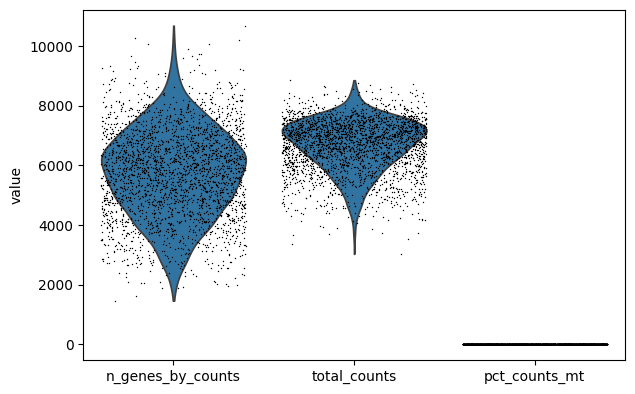
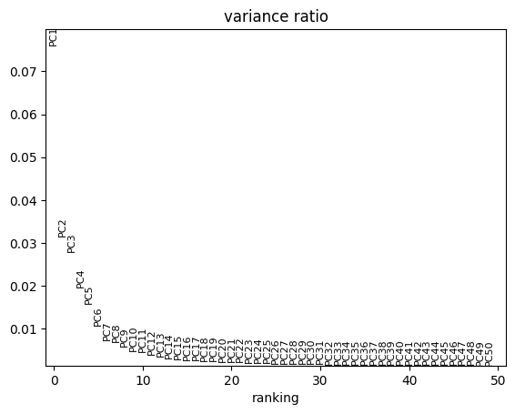
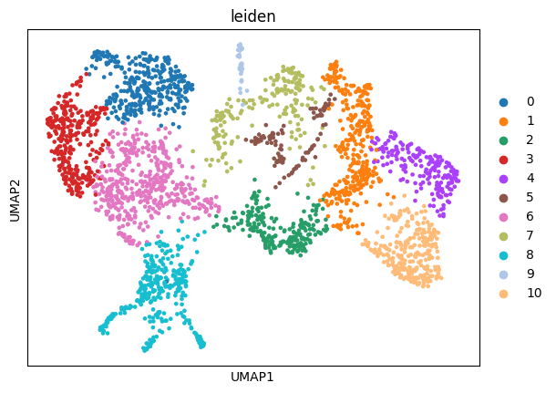
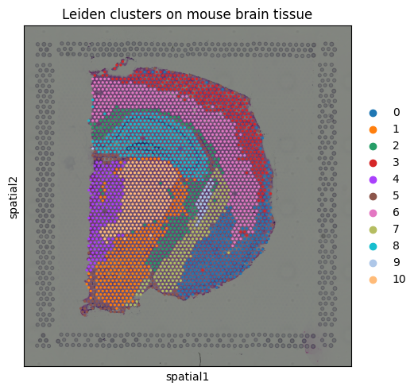
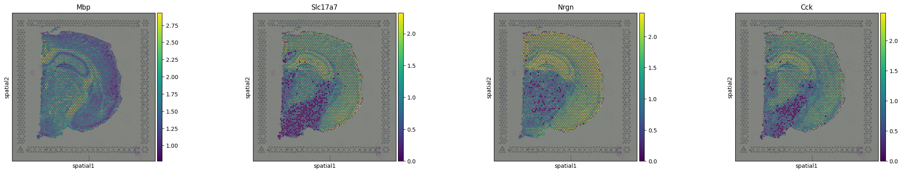

# Visium Cortical Structure Analysis

## The Question

Visium spots are 55 micrometers wide and typically capture RNA from multiple cells at once. That raises a practical question before you even think about deconvolution: how much of the underlying tissue organization is still detectable from those mixed spot signals?

This project tests that directly. I ran unsupervised clustering on a public 10x Genomics mouse brain Visium section and checked whether the resulting clusters align with visible anatomy and known marker gene distributions, without using any cell type labels or a single cell reference.

---

## Dataset

10x Genomics Visium coronal mouse brain section, loaded via the Squidpy datasets API. 2,688 spots covering cortex, hippocampus, white matter, and subcortical structures. After QC filtering, 16,957 genes remained. The top 2,000 highly variable genes were used for dimensionality reduction and clustering. The dataset loads with one line of code and runs under 2 GB RAM.

```python
import squidpy as sq
adata = sq.datasets.visium_hne_adata()
```

---

## What I Did

Library-size normalization to 10,000 counts per spot, log transformation, top 2,000 highly variable genes selected using the Seurat method. PCA on scaled values, 50 components computed, top 30 used for the neighbor graph. The variance ratio plot confirmed biological signal drops off before component 30. Leiden clustering at resolution 0.5 using 15 neighbors per spot. Spatially variable genes identified with Moran's I, 100 permutations, FDR corrected.

---

## Results

### Figure 1: QC Metrics Before Filtering



Three distributions across all spots before filtering: number of genes detected per spot, total UMI counts per spot, and mitochondrial read fraction. The mitochondrial fraction is uniformly low across the section, which confirms tissue integrity. No spots were removed by the mitochondrial filter. A small number of spots with fewer than 200 detected genes and genes detected in fewer than 10 spots were removed. The clean QC distributions here mean downstream clustering is not driven by a subset of damaged or low-quality spots.

---

### Figure 2: PCA Variance Ratio



Variance explained by each of the 50 PCA components. The curve drops steeply in the first 10 to 15 components and flattens out well before component 30. This confirms that the biologically meaningful variance is concentrated in the early components. Using 30 components for the neighbor graph captures all the real signal while excluding low-variance components that would add noise to the clustering.

---

### Figure 3: UMAP of Leiden Clusters



UMAP projection of all 2,688 spots colored by Leiden cluster. The 11 clusters separate into distinct groups in 2D space with minimal overlap between major groups. This shows the expression differences between clusters are substantial enough to produce clean separation in a nonlinear embedding. Clusters that appear close in UMAP space share more transcriptional similarity than those far apart. This plot is a sanity check before looking at the spatial overlay: if clusters were not well-separated here, spatial coherence on the tissue would be less meaningful.

---

### Figure 4: Leiden Clusters on Tissue



All 11 Leiden clusters overlaid on the H&E tissue image. Every cluster occupies a spatially contiguous domain. No cluster is scattered randomly across the tissue. The large orange region in the center and lower portion of the section corresponds to hippocampal structures. The curved outer region covering the right side of the section is consistent with cortical layers. The teal region on the left aligns with white matter tracts. The small red cluster concentrated at the upper portion of the hippocampal domain is consistent with dentate gyrus or a specialized hippocampal subfield.

This spatial coherence is the central result of the project. It demonstrates that gene expression differences between tissue regions are strong enough to drive anatomically meaningful clustering from spot-level data alone, without anatomical labels, cell type annotation, or deconvolution.

---

### Figure 5: Spatial Expression Maps for Top Spatially Variable Genes



Spatial expression of the top four genes by Moran's I: Mbp (0.788), Slc17a7 (0.775), Nrgn (0.743), and Cck (0.727).

Mbp is an oligodendrocyte marker and shows broad enrichment across the tissue with the strongest signal in white matter regions on the left, consistent with the white matter cluster in Figure 4.

Slc17a7 and Nrgn are both markers of excitatory neurons and show overlapping enrichment in the hippocampal and cortical domains. Their spatial overlap provides convergent gene-level evidence for the hippocampal cluster identified by clustering alone, without any anatomical annotation.

Cck marks cortical interneurons and shows a more restricted distribution, enriched in specific cortical layers and hippocampal subfields rather than across the full hippocampal domain.

The fact that these four genes, pulled purely by a spatial autocorrelation statistic, recover exactly the expected brain region markers independently validates the cluster structure from a completely different analytical angle.

---

## Top 10 Spatially Variable Genes

| Gene | Moran's I | Known Association |
|---|---|---|
| Mbp | 0.788 | Oligodendrocyte |
| Slc17a7 | 0.775 | Excitatory neuron |
| Nrgn | 0.743 | Hippocampal neuron |
| Cck | 0.727 | Cortical interneuron |
| Itpka | 0.698 | Neuron |
| Mobp | 0.696 | Oligodendrocyte |
| Camk2n1 | 0.695 | Excitatory neuron |
| Plp1 | 0.689 | Oligodendrocyte |
| Baiap3 | 0.689 | Neuron |
| Ddn | 0.681 | Dendritic spine |

Three oligodendrocyte markers and three excitatory neuron markers in the top ten is consistent with the dominant cell type composition differences between white matter and gray matter in this section.

---

## What This Does and Does Not Show

The clustering and Moran's I results are consistent with each other and with published mouse brain atlas data. But two limitations apply here and to any Visium-based analysis.

Spot mixing means clusters represent the dominant cell type mixture at each location, not a pure cell population. What looks like a hippocampal cluster is really a region where hippocampal neuron signal is dominant. Confirming actual cell type proportions requires deconvolution against a single cell reference. Cell2location with the Allen Brain Atlas dataset is the obvious next step here.

The second concern is technical capture variation. Uneven tissue thickness or permeabilization can create spatial count gradients that drive cluster separation independent of biology. That said, a purely technical gradient would not be expected to consistently recover known brain region markers like Nrgn and Mbp. The convergence of marker identity with cluster boundaries makes a pure artifact explanation unlikely, though not impossible to fully exclude.

---

## Next Steps

Deconvolution with Cell2location using the Allen Brain Atlas single cell reference to get cell type proportions per spot. Then neighborhood enrichment analysis in Squidpy to identify which cell types co-localize beyond chance. That is where ligand-receptor interaction analysis and niche-level biology become accessible. Validation of spatially variable genes against Allen Brain Atlas in situ hybridization data would provide independent anatomical confirmation of the Moran's I results.

---

## Reproducibility

Python 3.9. All packages are publicly available. No manual data download needed.

```
pip install scanpy squidpy matplotlib seaborn leidenalg igraph
```

Runs on a standard laptop or Google Colab free tier under 2 GB RAM.

---

## References

Staahl et al. 2016. Visualization and analysis of gene expression in tissue sections by spatial transcriptomics. Science.

Kleshchevnikov et al. 2022. Cell2location maps fine-grained cell types in spatial transcriptomics. Nature Biotechnology.

Palla et al. 2022. Squidpy: a scalable framework for spatial omics analysis. Nature Methods.

Moran P.A.P. 1950. Notes on continuous stochastic phenomena. Biometrika.
